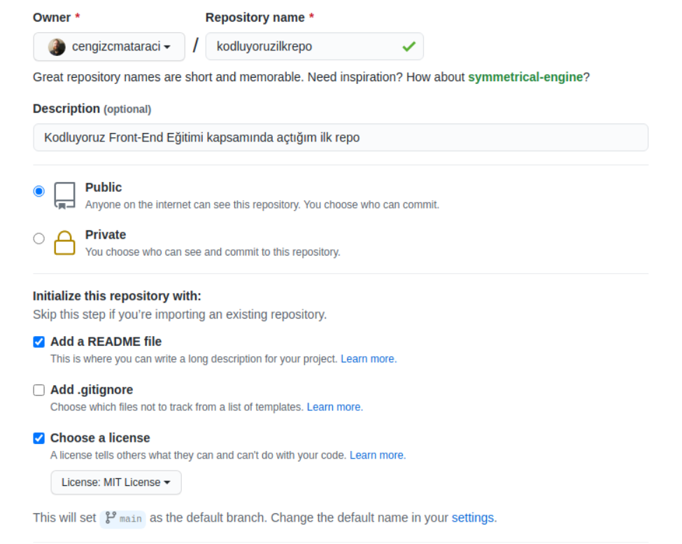

# kodluyoruzilkrepo
---------
Kodluyoruz Front-End Eğitimi kapsamında açtığım ilk repo. İçerisinde bir adet README dosyası, bir adet de index.html barındırıyor.

## Installation

Öncelikle projeyi clonlayın. (Buraya sizin reponuzdan aldığınız link gelecek)

'''bash
git clone https://github.com/meryemiscan/kodluyoruzilkrepo
'''

## Usage

Projeyi cloneladıktan sonra Visual Studio Code programında açınız.

Linux için:
'''Linux
cd kodluyoruzilkrepo
code .
'''

## Contributing
Pull requestler kabul edilir. Büyük değişiklikler için, lütfen önce neyi değiştirmek istediğinizi tartışmak için bir konu açınız.

## License
[MIT](https://choosealicense.com/mit/)